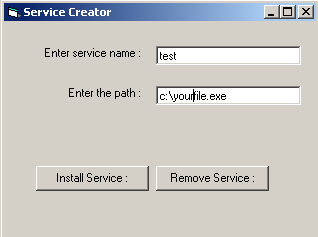



## Creating NT services

### Description

This code can be created to register any application as NT/2000 Services.

You can register application as Service as well as you can unregister them using the same code.
 
### More Info
 
Please read the comments in the beginning of services form.

This is a basic code and I have not created any validation procedure for anything, so You can do that easily such as if someone puts some garbage value in the place of application name then this won't give any warning or anything.

In the screen shot you can see two text boxes .

First one is to enter the name as you want to resgister your application as service.

Second one is to specift the path of the application

As this program makes registry entries so I recommend to take the back up.

I will not be responsible for any mess while I have already tested it in my machine without any error.

While the program is duly tested bya virus scanner in my machine I still recommend to sacn it , I will be no where responsible for Viruses..

             |
---                |---
**Submitted On**   |2002-03-19 14:41:34
**By**             |[HimanshuD](https://github.com/Planet-Source-Code/PSCIndex/blob/master/ByAuthor/himanshud.md)
**Level**          |Intermediate
**User Rating**    |3.7 (44 globes from 12 users)
**Compatibility**  |VB 6\.0
**Category**       |[Complete Applications](https://github.com/Planet-Source-Code/PSCIndex/blob/master/ByCategory/complete-applications__1-27.md)
**World**          |[Visual Basic](https://github.com/Planet-Source-Code/PSCIndex/blob/master/ByWorld/visual-basic.md)
**Archive File**   |[Creating\_N633993192002\.zip](https://github.com/Planet-Source-Code/himanshud-creating-nt-services__1-32828/archive/master.zip)

